# FivetranConnector Reconciliation Sequence Diagram

This high-level sequence diagram shows the main flow of the FivetranConnector reconciliation process, focusing on the key phases and external system interactions.

```mermaid
sequenceDiagram
    participant K8s as Kubernetes API
    participant R as FivetranConnectorReconciler
    participant V as Vault
    participant F as Fivetran API

    %% 1. Initial Setup
    K8s->>R: Reconcile Event
    R->>K8s: Get FivetranConnector Resource
    K8s-->>R: FivetranConnector Spec

    %% 2. Handle Deletion
    alt Connector is being deleted
        R->>F: Delete Fivetran Connector
        F-->>R: Deletion Success
        R->>K8s: Remove Finalizer & Update Status
        R-->>K8s: Return (Reconciliation Complete)
    end

    %% 3. Initialize Dependencies
    R->>V: Initialize Vault Client (if needed)
    V-->>R: Vault Client Ready
    R->>K8s: Add Finalizer (if missing)

    %% 4. Check if Work Needed
    R->>R: Determine What to Reconcile
    Note over R: Check for changes in config/schema<br/>or force reconcile annotation

    alt No changes detected
        R-->>K8s: Return (No Action Needed)
    end

    %% 5. Resolve Secrets
    R->>V: Resolve vault:// references
    V-->>R: Resolved Secrets

    %% 6. Connector Reconciliation
    alt Connector needs reconciliation
        alt Connector doesn't exist
            R->>F: Create New Connector
            F-->>R: Connector ID
        else Connector exists
            R->>F: Update Existing Connector
            F-->>R: Update Success
        end
        
        R->>K8s: Update Status & Annotations
    end

    %% 7. Setup Tests (Optional)
    alt Setup tests enabled
        R->>F: Run Setup Tests
        F-->>R: Test Results
        R->>K8s: Update Test Status
    end

    %% 8. Schema Configuration (Optional)
    alt Schema config provided
        R->>F: Get Schema Details
        F-->>R: Schema Details (or not found)

        alt Schema not found
            R->>F: Reload Schema (discover from source)
            F-->>R: Reload Success
            R->>F: Get Schema Details
            F-->>R: Schema Details
        else CR references unknown schemas/tables
            R->>F: Reload Schema
            F-->>R: Reload Success
            R->>F: Get Schema Details
            F-->>R: Updated Schema Details
        end

        alt CR has column configs (BLOCK_ALL/ALLOW_COLUMNS)
            R->>F: Get Column Config (per-table endpoint)
            F-->>R: Column details + enabled_patch_settings
            R->>R: Validate locked columns
        end

        R->>R: BuildSchemaConfig(cr, upstream)
        R->>F: Update Schema (first pass)
        F-->>R: Schema Updated

        alt Columns were missing (brand-new tables)
            R->>F: Get Schema Details (second pass)
            F-->>R: Updated Schema with columns
            R->>F: Get Column Config (per-table)
            F-->>R: Column details
            R->>R: BuildSchemaConfig(cr, upstream)
            R->>F: Update Schema (second pass)
            F-->>R: Schema Updated
        end

        alt Validation enabled
            R->>F: Get Schema Details (verify)
            F-->>R: Final Schema State
            R->>R: CompareSchemaWithCR
        end

        R->>K8s: Update Schema Status
    end

    %% 9. Final Steps
    R->>K8s: Clean up annotations
    R->>K8s: Update Final Status
    R-->>K8s: Return (Reconciliation Complete)
```

## Reconciliation Flow Overview

The FivetranConnector reconciliation follows these **9 main phases**:

### 1. **Initial Setup**
- Controller receives reconcile event from Kubernetes
- Fetches the FivetranConnector resource specification

### 2. **Deletion Handling** 
- If connector is being deleted, removes it from Fivetran and cleans up
- Early exit after successful deletion

### 3. **Initialize Dependencies**
- Sets up Vault client for secret management (if needed)
- Ensures finalizer is present to handle cleanup

### 4. **Determine Work Needed**
- Checks if configuration or schema has changed
- Supports force reconcile via annotation
- Skips work if no changes detected

### 5. **Secret Resolution**
- Resolves any `vault:path#key` references in connector config/auth
- Retrieves secrets securely from Vault

### 6. **Connector Reconciliation**
- **Creates** new connector in Fivetran (if doesn't exist)
- **Updates** existing connector configuration (if changed)
- Updates Kubernetes status with connector details

### 7. **Setup Tests** _(Optional)_
- Runs Fivetran setup tests to validate connectivity
- Reports test results in connector status

### 8. **Schema Configuration** _(Optional)_
- Gets current schema from Fivetran; reloads if not found or CR references undiscovered items
- For `BLOCK_ALL`/`ALLOW_COLUMNS` policies with column configs: fetches per-table column data and validates locked columns
- Builds schema payload via `BuildSchemaConfig(cr, upstream)` enforcing `schema_change_handling` policy
- Applies schema (first pass); if columns were missing (brand-new tables), runs a second pass after columns become visible
- Verifies final schema state matches the CR (when validation is enabled)

### 9. **Final Steps**
- Removes temporary annotations and labels
- Updates final status conditions
- Completes reconciliation cycle

## Key Features

- **Smart Change Detection**: Only reconciles when changes are detected
- **Secure Secret Management**: Integration with Vault for credentials
- **Policy Enforcement**: `schema_change_handling` enforced at schema, table, and column levels
- **Locked Column Safety**: Non-retriable error if CR attempts to disable primary keys or system columns
- **Error Handling**: Proper status reporting; non-retriable errors (locked columns, schema mismatch) stop the reconcile loop
